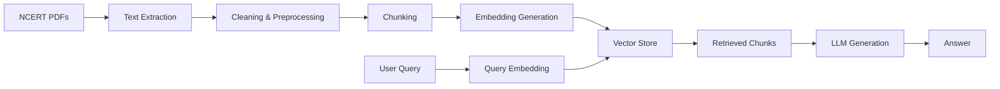

# NCERT RAG — NEET Exam Q&A System

A **Retrieval-Augmented Generation (RAG)** system that answers NEET exam questions using NCERT textbooks (Class 11 & 12 — Physics, Chemistry, Biology).

## 📚 Data Sources

| Subject   | Class 11 | Class 12 |
|-----------|----------|----------|
| Physics   | keph1dd  | leph1dd  |
| Chemistry | kech1dd, kech2dd | lech1dd, lech2dd |
| Biology   | kebo1dd  | lebo1dd  |

> **Naming convention**: `k` = class 11, `l` = class 12, `e` = English, `ph/ch/bo` = subject, `1/2` = part number, `dd` = edition

## 🏗️ Project Structure

```
NCERT_RAG/
├── dataset/pdfs/          # Raw NCERT PDFs (organized by subject/class)
├── data/
│   ├── processed/         # Extracted & cleaned text
│   ├── chunks/            # Chunked text segments
│   ├── vector_store/      # Vector embeddings database
│   └── evaluation/        # Evaluation datasets & results
├── src/
│   ├── data_processing/   # PDF extraction, cleaning, chunking
│   ├── embedding/         # Embedding generation & vector store
│   ├── retrieval/         # Retrieval strategies (sparse, dense, hybrid)
│   ├── generation/        # LLM integration & response generation
│   ├── api/               # FastAPI / REST endpoints
│   ├── evaluation/        # RAGAS evaluation & metrics
│   └── utils/             # Shared utilities
├── configs/               # YAML configuration files
├── notebooks/             # Jupyter notebooks for exploration
├── tests/                 # Unit & integration tests
├── scripts/               # One-off utility scripts
├── docker/                # Docker & docker-compose files
├── requirements.txt       # Python dependencies
└── README.md
```

## 🚀 Quick Start

### 1. Setup Environment

```bash
python -m venv venv
source venv/bin/activate  # Linux/macOS
pip install -r requirements.txt
```

### 2. Process PDFs

```bash
python scripts/process_pdfs.py
```

### 3. Generate Embeddings

```bash
python scripts/generate_embeddings.py
```

### 4. Run the API

```bash
uvicorn src.api.main:app --reload
```

### 5. Ask Questions

```
POST http://localhost:8000/query
{
  "question": "Explain the process of photosynthesis.",
  "subject": "biology",
  "class": 11,
  "top_k": 5
}
```

## 🐳 Docker

```bash
docker-compose -f docker/docker-compose.yml up
```

## 🧪 Evaluation

```bash
python -m pytest tests/
python scripts/evaluate_rag.py
```

## 📊 RAG Pipeline



## 🔧 Tech Stack

- **PDF Processing**: PyMuPDF / pdfplumber
- **Embeddings**: sentence-transformers / OpenAI
- **Vector Store**: ChromaDB / FAISS / Qdrant
- **LLM**: OpenAI / Anthropic / Local (Ollama)
- **API**: FastAPI
- **Evaluation**: RAGAS

## 📝 License

MIT